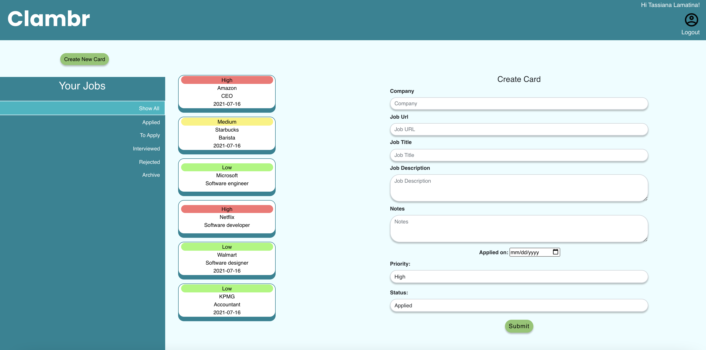

# Welcome to Clambr!

Clambr was a joint creation made to help you simplyfy your job hunt.

Has your job search become tricky because you can't remember all the jobs you've applied to?
This is exactly why we have created Clambr. With our app you can record and keep track of all the jobs you are interested in with specifiic information to help you ace your interview stage. 

We used a combination of React, Javascript, bootstrap, MongoDB, Express RESTful routes, axios, jsonWebtoken, DOM manipulation, Styled Components, Asana, Figma and Zeplin. (If you plan on cloning our App please do not forget to "**npm i**" inside your terminal to get all of our dependencies up and running.)

We were able to come to a compromise pretty quickly on our theme since we're all going to be joining the job-search field in a couple of weeks. Our main goal was to create something extremely simple that could assist absolutely anyone in tracking/logging all of the jobs they're interested in. After pitching our ideas to the UX team we were able to come up with the entire layout and all functionalities very quickly. Everyone was thinking along the same lines and the whole project came together in a snap. 

here is the link for our Wireframes, Moodboard and User Story created by our awesome UX team:
https://www.figma.com/file/4KDTdoQgUrqkazCW3g35wk/Collabathon_503%2F517?node-id=80%3A1084

Our only unresolved issues as of now are our stretch goals.
The strech goals are:
1. OAuth
2. Remember Me checkbox connected to local storage
3. Sort button Filter for job cards
4. Option to upload files with Cloudinary
5. Option to customize user profile image

